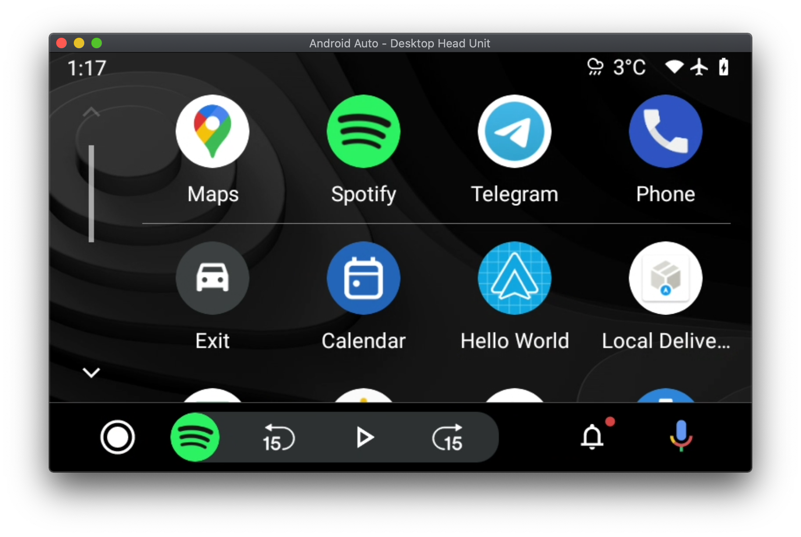
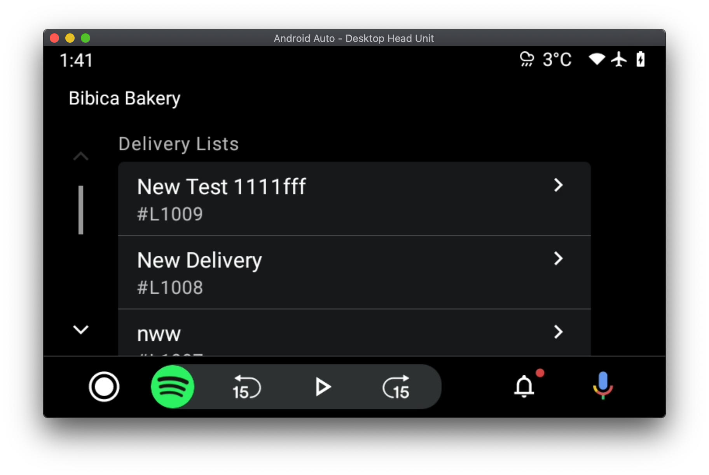

# react-native-android-auto

A react native module (+ a react renderer) to control android auto app UI from JavaScript and with React code. (and of cource independently of MainActivity!)


## Getting started

`$ npm install react-native-android-auto --save`

### Mostly automatic installation

In order to display the app launcher in the car display:



You need to add the following lines to your app's `AndroidManifest.xml` under `<application>`:

```xml
<meta-data
    android:name="com.google.android.gms.car.application"
    android:resource="@xml/automotive_app_desc" />

<service
    android:name="com.shopify.rnandroidauto.CarService"
    android:exported="true">
    <intent-filter>
    <action android:name="com.google.android.car.action.CAR_APP" />
    </intent-filter>
</service>
```

And create a new file: `android/app/src/main/res/xml/automotive_app_desc.xml` with the following contents:

```xml
<?xml version="1.0" encoding="utf-8"?>

<automotiveApp>
  <uses name="template" />
</automotiveApp>
```

## Usage

```javascript
import { Screen, ScreenManager } from "react-native-android-auto";
```

In order to start your app's android auto screen, you need to register a root component it via AppRegistery:

```ts
import React from "react";
import { AppRegistry } from "react-native";

import { render } from "react-native-android-auto";

// RootApp -> The component

AppRegistry.registerRunnable("androidAuto", () => {
  render(React.createElement(RootApp));
});
```

The root component must eventually render a `ScreenManager` with at least one `Screen`. Just note that the ScreenManager doesn't need to be an immediate child of root component.

```tsx
export function RootApp() {
  return (
    <ScreenManager>
      <Screen name="root" render={Main} />
      <Screen name="deliveryList" render={DeliveryListScreen} />
      <Screen name="deliveryDetails" render={DeliveryDetails} />
    </ScreenManager>
  );
}
```

A `Screen` with `name="root"` is required to start the app, otherwise the app will be stuck in an infinite loading state.

The react renderer comes with a bunch of native elements specific to Android Auto.

## Example screen code

```tsx
import {useCarNavigation} from 'react-native-android-auto';

export function Main() {
  const shop = useShop();
  const navigation = useCarNavigation();
  const { loading, data } = useQuery(deliveryListsQuery);

  return (
    <list-template
      title={shop.name ?? "Shopify Local Delivery"}
      isLoading={loading || !data}
    >
      <item-list header="Delivery Lists">
        {data.deliveryListEdges.slice(0, 5).map(({ node }) => (
          <row
            key={node.id}
            title={node.description}
            texts={[node.name]}
            onPress={() => {
              navigation.push("deliveryList", {
                deliveryList: node,
              });
            }}
          />
        ))}
      </item-list>
    </list-template>
  );
}
```



## JSX Tags

### Templates

A `Screen`'s given render component's immediate child must be a template element. Currently, `pane-template`, `list-template`, and `place-list-map-template` are supported.

#### pane-template

| Prop         | Type           | Description                                                   |
| ------------ | -------------- | ------------------------------------------------------------- |
| title        | `string`       | The title of the screen shown at the top left                 |
| headerAction | `HeaderAction` |                                                               |
| actionStrip  | `ActionStrip`  |                                                               |
| children     | `ReactNode[]`  | only accepts instances of `<row />` and `<action />` as child |

#### list-template

| Prop         | Type           | Description                                                      |
| ------------ | -------------- | ---------------------------------------------------------------- |
| title        | `string`       | The title of the screen shown at the top left                    |
| headerAction | `HeaderAction` |                                                                  |
| actionStrip  | `ActionStrip`  |                                                                  |
| isLoading    | `boolean`      | Whether to ignore displaying children and show a spinner instead |
| children     | `ReactNode[]`  | only accepts instances of `<item-list />` as child               |

#### place-list-map-template

| Prop         | Type           | Description                                                      |
| ------------ | -------------- | ---------------------------------------------------------------- |
| title        | `string`       | The title of the screen shown at the top left                    |
| headerAction | `HeaderAction` |                                                                  |
| actionStrip  | `ActionStrip`  |                                                                  |
| isLoading    | `boolean`      | Whether to ignore displaying children and show a spinner instead |
| children     | `ReactNode[]`  | only accepts instances of `<row />` as child                     |

### Other tags

#### row

| Prop      | Type               | Description                                                                 |
| --------- | ------------------ | --------------------------------------------------------------------------- |
| title     | string             | Title of the row                                                            |
| texts?    | string[]           | You can specify multiple lines of texts to be displayed under the row title |
| onPress?  | (event: {}) => any | A callback function invoked when user touches the row on the car display    |
| metadata? | `Metadata`         |                                                                             |

#### action

| Prop             | Type               | Description                                                                 |
| ---------------- | ------------------ | --------------------------------------------------------------------------- |
| title            | string             | Title of the row                                                            |
| texts?           | string[]           | You can specify multiple lines of texts to be displayed under the row title |
| onPress?         | (event: {}) => any | A callback function invoked when user touches the row on the car display    |
| backgroundColor? | `CarColor`         |                                                                             |

#### item-list

| Prop     | Type          | Description                                  |
| -------- | ------------- | -------------------------------------------- |
| header   | string        | Title of the row                             |
| children | `ReactNode[]` | only accepts instances of `<row />` as child |

## Want to contribute?

Check out our [Contributing Guide](./.github/CONTRIBUTING.md)

## License

MIT &copy; [Shopify](https://shopify.com/), see [LICENSE.md](LICENSE.md) for details.
